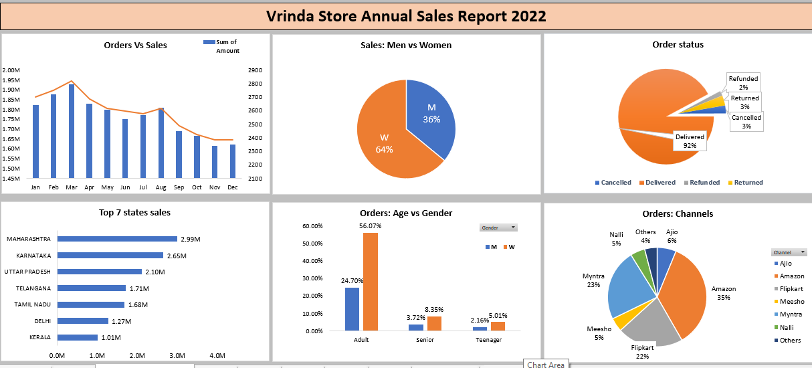

# Raj's Data Analysis Dashboard (Interactive Dashboard using MS Excel)

## Project Overview
This project focuses on creating a comprehensive annual sales report for 2022 to help identify key customer trends and drive sales growth for 2023 and 2024. The dashboard provides actionable insights into sales performance, customer demographics, and channel effectiveness.

## Project Objective
The goal is to analyze sales data to understand customer behavior, identify top-performing regions, and optimize marketing strategies for future growth.

## Key Questions & KPIs
- **Sales vs. Orders**: Comparative analysis using integrated charts.
- **Peak Performance**: Identifying months with the highest sales and order volume.
- **Gender Analysis**: Comparison of purchasing patterns between Men and Women.
- **Order Fulfillment**: Tracking various order statuses throughout 2022.
- **Geographic Insights**: Top 10 contributing states to total sales.
- **Demographic Trends**: Relationship between age, gender, and order frequency.
- **Channel Performance**: Identifying the most effective sales channels (Amazon, Flipkart, Myntra, etc.).
- **Product Category Analysis**: Determining the highest-selling categories.

## Methodology
1. **Data Cleaning**: Handled missing values, removed anomalies, and ensured consistency in data types and formats.
2. **Pivot Tables**: Generated dynamic pivot tables to answer specific business questions.
3. **Dashboard Creation**: Integrated all pivot tables into a single, interactive dashboard with slicers for real-time filtering.

## Dashboard Preview

## Technologies Used
- Microsoft Excel (Pivot Tables, Slicers, Data Visualization)

## Project Insights
- **Customer Base**: Women represent the majority of customers (~65%).
- **Top Regions**: Maharashtra, Karnataka, and Uttar Pradesh are the leading states in sales.
- **Target Age Group**: The adult demographic (30-49 years) contributes approximately 50% of total sales.
- **Dominant Channels**: Amazon, Flipkart, and Myntra are the primary drivers of order volume.
- **Success Rate**: Over 90% of orders were successfully delivered.

## Conclusion
To maximize growth, marketing efforts should be prioritized towards women in the 30-49 age group within Maharashtra, Karnataka, and Uttar Pradesh. Utilizing targeted digital campaigns on major platforms like Amazon and Flipkart will likely yield the highest ROI.

---
*Created by Raj Sharma*
